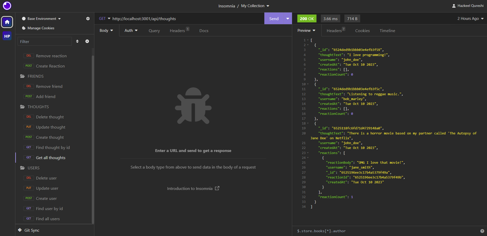

# social-network-api 📝


## Description 📄

An API created with Express.js, MongoDB, and the Mongoose npm module. Users, Thoughts, and Reactions are the three main data models that the API is intended to help manage. Developers can conduct necessary CRUD (Create, Read, Update, Delete) actions on the data thanks to the extensive set of routes it provides.

## Table of Contents

- [Key Features](#features) 🔑
- [Installation](#installation) 🛠️
- [Usage](#usage) 📘
- [Contributing](#contributing) 🤝
- [Tests](#tests) 🧪
- [License](#license) 📜
- [Credits](#credits) 🙏
- [Questions](#questions) ❓
- [Deployed Application](#link) 🚀

## <a name="features"></a>Key Features 🔑

**Express.js Framework:** By utilizing the strength of Express.js, this API offers quick and effective middleware and routing capabilities.

**MongoDB Database:** To store and retrieve data quickly, the API effortlessly connects with MongoDB, a dependable NoSQL database.

**Mongoose npm Library:** Mongoose streamlines interaction with MongoDB by making data modeling and validation easier.

**User, Thought, Reaction Model:** The API comes with User and Thought models that make it possible to create, retrieve, update, and delete user and thoughts data. The Reaction model provides a complete solution for handling reactions to thoughts and allows developers to interact with reactions.

**HTTP Methods:** The API offers developers a flexible and comprehensive set of HTTP methods, including GET, PUT, POST, and DELETE.

## <a name="installation"></a>Installation 🛠️

To install the necessary dependencies, run the following command:

```
npm i
npm install express@4.17.1
npm install mongoose@7.0.2
```

Install DevDependency for developing purposes:

```
npm install nodemon@2.0.3
```

## <a name="usage"></a>Usage 📘

- Clone the repository to your local system.
- Install dependencies to the project directory and typing npm install to get everything set up.
- Make sure you have a MongoDB instance running locally or on a remote server before setting up MongoDB. Set up the connection information as necessary in your application code.
- Run the application by using a process manager ```node server.js``` to start the Express.js server.
- Explore the API: By sending HTTP queries to the specified routes, you can now explore the API.

### Following are the API routes:

**`/api/users`**
* `GET` all users
* `POST` a new user:

```json
// example data
{
  "username": "lernantino",
  "email": "lernantino@gmail.com"
}
```

**`/api/users/:userId`**
* `GET` a single user by its `_id` and populated thought and friend data
* `PUT` to update a user by its `_id`
* `DELETE` to remove user by its `_id`


**`/api/users/:userId/friends/:friendId`**
* `POST` to add a new friend to a user's friend list
* `DELETE` to remove a friend from a user's friend list

**`/api/thoughts`**
* `GET` to get all thoughts
* `POST` to create a new thought
```json
// example data
{
  "thoughtText": "Here's a cool thought...",
  "username": "lernantino",
}
```

**`/api/thoughts/:thoughtId`**
* `GET` to get a single thought by its `_id`
* `PUT` to update a thought by its `_id`
* `DELETE` to remove a thought by its `_id`

**`/api/thoughts/:thoughtId/reactions`**
* `POST` to create a reaction stored in a single thought's `reactions` array field

**`/api/thoughts/:thoughtId/reactions/:reactionId`**
* `DELETE` to pull and remove a reaction by the reaction's `reactionId` value

### Following is a video demonstrating how to run the application. 🎥

[](https://drive.google.com/file/d/1j5PwWSdAqfp0a-7-Ektc6K7UjFg3xFHB/view)

## <a name="contributing"></a>Contribution 🤝

Contributions to this API project are welcome. If you encounter issues, have suggestions for improvements, or would like to contribute, please open an issue or submit a pull request.

## <a name="tests"></a>Tests 🧪

To run tests, users can install insomnia and run HTTP requests. Please refer to the usage section.

## <a name="license"></a>License 📜

This project is licensed under The MIT License. Here is the link to the license to access more information for your reference: [https://opensource.org/licenses/MIT](https://opensource.org/licenses/MIT)

## <a name="credits"></a>Credits 🙏

I utilized the study material provided by the institution as a reference to complete my application.

Following are the documents I used to help me write code:

- [MongoDB Compass docs on Connect to MongoDB](https://docs.mongodb.com/compass/current/connect/)
- [MongoDB Compass docs on Embedded MongoDB Shell](https://docs.mongodb.com/compass/current/embedded-shell/)
- [MongoDB docs on Creating a MongoDB Database with the CLI (the MongoDB shell)](https://www.mongodb.com/basics/create-database)
- [MongoDB docs on MongoDB CRUD Operations](https://docs.mongodb.com/manual/crud/)
- [MongoDB Compass docs on View Documents](https://docs.mongodb.com/compass/current/documents/view/)
- [MongoDB Compass docs on Modify Documents](https://docs.mongodb.com/compass/current/documents/modify/)
- [Official MongoDB Node Driver docs on Connecting to Database](https://github.com/mongodb/node-mongodb-native#connect-to-mongodb)
- [MongoDB docs on Find a Document](https://docs.mongodb.com/manual/reference/method/db.collection.find/)
- [MongoDB docs on Insert a Document](https://docs.mongodb.com/manual/tutorial/insert-documents/)
- [MongoDB docs on Sort](https://docs.mongodb.com/manual/reference/method/cursor.sort/)
- [MongoDB docs on Skip](https://docs.mongodb.com/manual/reference/method/cursor.skip/)
- [MongoDB docs on Limit](https://docs.mongodb.com/manual/reference/method/cursor.limit/)
- [Mongoose docs on models](https://mongoosejs.com/docs/models.html)
- [Mongoose docs on schemas](https://mongoosejs.com/docs/guide.html)
- [Mongoose docs on validation](https://mongoosejs.com/docs/validation.html)
- [Mongoose docs on findOneAndUpdate()](https://mongoosejs.com/docs/tutorials/findoneandupdate.html)
- [Mongoose docs on subdocuments](https://mongoosejs.com/docs/subdocs.html)
- [Mongoose docs on constructing models](https://mongoosejs.com/docs/models.html)
- [How can we use the `ObjectId` to ensure we are able to query a student based on the value in their `_id` field?](https://mongoosejs.com/docs/schematypes.html#objectids)
- [deploy-with-heroku-and-mongodb-atlas](https://coding-boot-camp.github.io/full-stack/mongodb/deploy-with-heroku-and-mongodb-atlas)

## <a name="questions"></a>Questions ❓

If you have further questions, you are welcome to reach me through my email at hazkeel27@gmail.com.

You can view my projects by going through my GitHub profile at [https://github.com/hazkeel27](https://github.com/hazkeel27).

## <a name="link"></a>Deployed Application 🚀

[]()